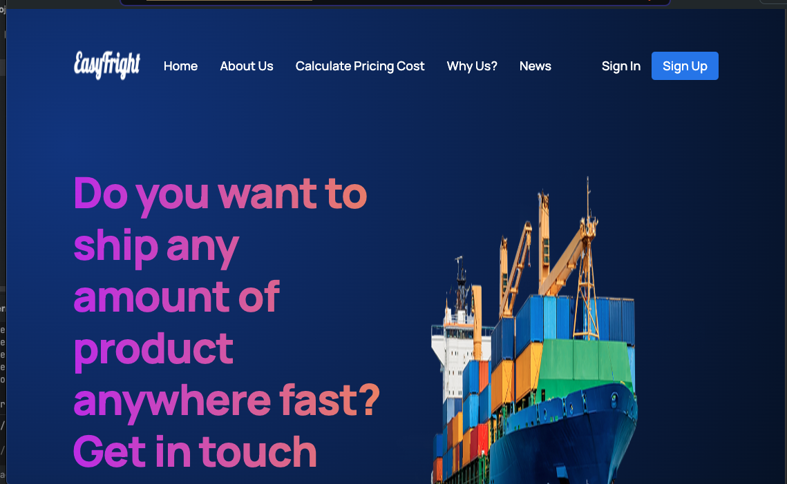
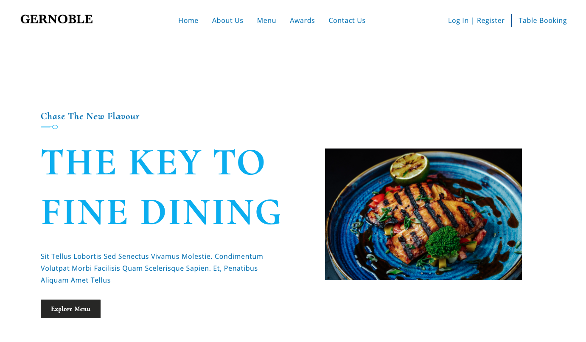
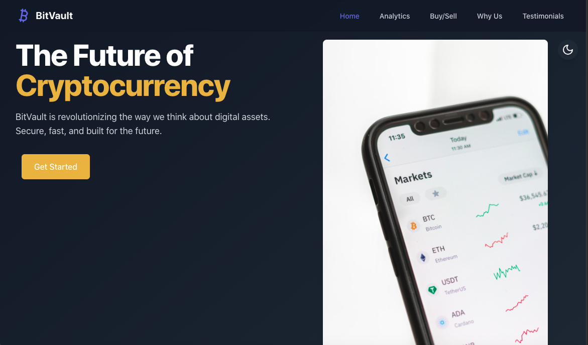
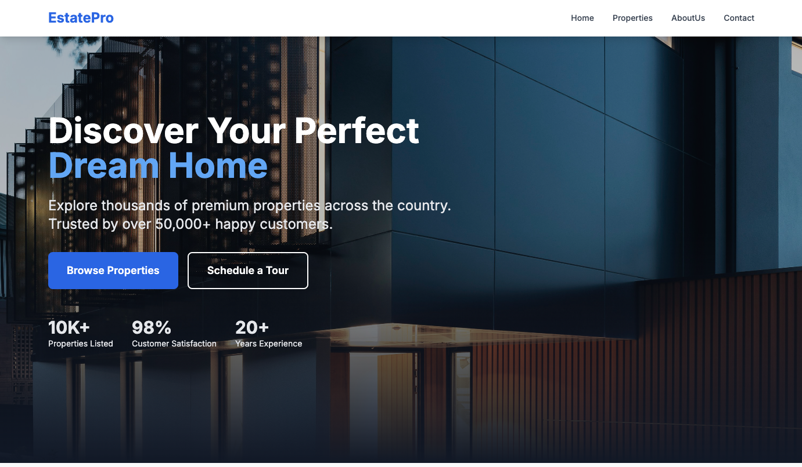

# 🚀 Frontend Projects Overview

Welcome to my frontend design portfolio! This repository contains four one-page frontend designs that I did while learning React, NextJS and Vite. across different industries: **Logistics, Restaurant, Cryptocurrency, and Real Estate**.

---

## 📌 Projects Overview

### 1️⃣ Logistics
- **Tech Stack:** React.js, CSS3
- **Live Demo:** [Deployment Link](#)
- **How to Run:**
  ```sh
  cd logistics
  npm install --legacy-peer-deps
  npm run build && npm run start
  ```

### 2️⃣ Restaurant
- **Tech Stack:** React.js, CSS3
- **Live Demo:** [Deployment Link](#)
- **How to Run:**
  ```sh
  cd restaurant
  npm install --legacy-peer-deps
  npm run build && npm run start
  ```

### 3️⃣ Cryptocurrency
- **Tech Stack:** Vite, TailwindCSS
- **Live Demo:** [Deployment Link](#)
- **How to Run:**
  ```sh
  cd cryptocurrency
  npm install --legacy-peer-deps
  npm run build && npm run serve
  ```

### 4️⃣ Real Estate
- **Tech Stack:** NextJS, TailwindCSS
- **Live Demo:** [Deployment Link](#)
- **How to Run:**
  ```sh
  cd real-estate
  npm install --legacy-peer-deps
  npm run build && npm run start
  ```

---

## 🛠 Deployment
All projects are deployed for easy access. Click on the **Live Demo** links above to explore each design.

---

## 🖼️ Preview





---

## 🤝 Contributing
Contribution are not accepted for this repository. If you have any suggestions or feedback, please don't hesitate to reach out to me.

📩 **Contact:** [Zahid Hasan](mailto:mdzahidhasancz@gmail.com)

